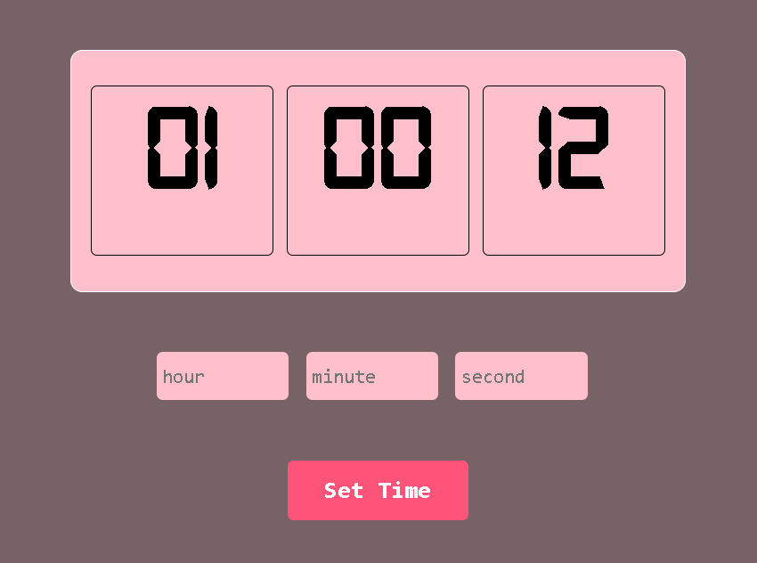

## Digital Watch Web App

This is a simple digital watch created using HTML, CSS, and JavaScript. It displays the current time in real-time and uses a custom font for styling the time display.

# Features

- Live digital clock
- Custom font styling
- Responsive and minimal design

# How to Use

1. Clone or download this repository.
2. Open the `index.html` file in your browser.
3. You will see a live digital watch on the screen.

# Technologies Used

- HTML
- CSS
- JavaScript

## Font

The project uses a custom font (`Digital-7.ttf`) for the clock display.

## Preview

## Author

Created by Jeevan Kumar
